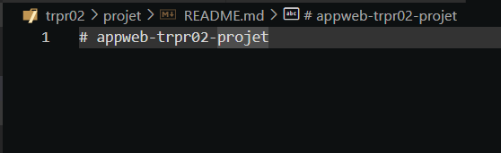
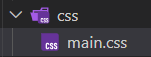
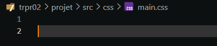

# Première révision de code

## Recommandations non urgentes

#### Fichier README.md vide

Le fichier *README.md* est encore vide. Bien qu'il n'est pas nécessaire de le remplir pour l'instant, y mettre des notes serait une bonne idée.

#### Présence d'un dossier obsolète

Le dossier *css* ainsi que son fichier *main.css* ne contiennent aucunes informations et peuvent donc être effacés.

#### Affichage de la barre de naviguation

La barre de naviguation n'est pas très belle. Si possible, implémenter le *navbar* de *bootstrap* serait une bonne idée.

#### Améliorations de l'UI du tableau de pointage

Le message d'erreur pour une erreur de chargement est correcte, mais pourrait être amélioré avec un *background* ou un *toast*. Si possible, une façon de montrer si la tableau est en cours de chargement serait bien.

## Modifications à faire le plus tôt possible

**Puisque peu de code a été écrit pour l'instant et qu'il n'y a rien de compliqué ou de manquant, je ne vois rien à mettre dans cette catégorie.**